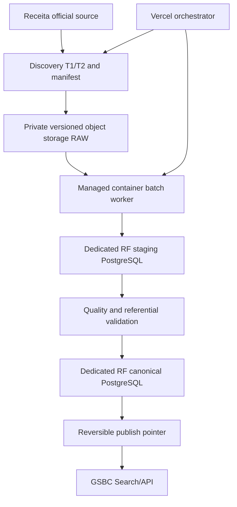

# RF-03A.1 Official Source & Infrastructure Readiness Report

Data: 2026-09-17

## 1. Executive Summary

RF-03A.1 executou discovery read-only da fonte oficial, inventario da infraestrutura atual, comparacao de database placement, worker, object storage e recovery. Nenhuma ingestao, migration, escrita remota, infraestrutura, cron ou publicacao foi criada.

A Receita e o catalogo oficial confirmam a existencia, o layout e a atualizacao mensal dos dados abertos CNPJ. Entretanto, o compartilhamento `arquivos.receitafederal.gov.br` encerrou todas as conexoes antes de uma resposta HTTP, o endpoint legado expirou e a API do catalogo retornou `401`. Nao foi possivel obter listing autoritativo, competencia atual, arquivos, tamanhos, checksums ou manifest. Resultado: **OFFICIAL SOURCE NOT VERIFIED**.

Sem manifest oficial e sem amostra oficial multi-entidade, volume nacional comprimido, expansion ratio representativo, tamanho canonical, pico de trabalho e janela de ingestao permanecem `UNKNOWN`. O POC RF-03A continua valido apenas como prova mecanica.

A arquitetura recomendada e **managed container batch job + private versioned S3-compatible object storage + dedicated RF PostgreSQL**, com Vercel apenas para orquestracao. A classe arquitetural esta decidida; fornecedor, regiao, capacidade e custo dependem de evidencias e aprovacao do proprietario.

O Supabase atual esta `ACTIVE_HEALTHY` em `eu-west-1`, mas plano/capacidade/uso nao ficaram observaveis e o recovery gate falhou: `pitr_enabled=false`, sem backups enumerados ou restore testado. O PostgreSQL compartilhado nao e recomendado para a carga nacional.

**RF-03A.1 Gate: NO-GO. RF-03B: NOT READY.** Permanecem dois P0: fonte oficial nao verificavel/consumivel e sizing nacional indefensavel.

## 2. Entry Baseline

```text
Branch: main
HEAD: 30ac3c12dd7609ee76efef35d01654219bab23f3
Working tree at preflight: clean
Local/remote migrations: 0001-0046 aligned
RF-03A: NO-GO
Production RF ingestion/cron: absent
```

O baseline nao divergiu materialmente. `vercel.json` contem somente os crons existentes de collection engine, prospectos e backup; nenhum cron RF existe.

## 3. Scope And Guardrails

Executado: `DISCOVER -> VERIFY -> MEASURE -> COMPARE -> DECIDE -> DOCUMENT`.

Nao executado: ingestao nacional, carga RF em producao, download por mirror, publicacao, RF-03B, migration, novo worker, bucket, database, cron, alteracao de grants/RLS, deploy, commit ou push.

## 4. Official Source Validation

Status: **NOT VERIFIED**.

Fontes oficiais acessiveis:

- pagina Receita de Cadastros, que identifica CNPJ e aponta ao catalogo PBDA;
- pagina oficial do dataset em dados.gov.br, HTTP 200;
- layout oficial `cnpj-metadados.pdf`;
- Nota Tecnica COCAD 47/2024, que declara atualizacao mensal;
- paginas oficiais do CNPJ alfanumerico e emissao do primeiro identificador alfanumerico em 2026-07-31.

Fonte de arquivos nao acessivel:

- `arquivos.receitafederal.gov.br` resolveu DNS, mas resetou HEAD/GET/Range no root, share e DAV;
- `dadosabertos.rfb.gov.br/CNPJ/dados_abertos_cnpj/` expirou na conexao;
- a API `/api/publico/conjuntos-dados/...` retornou HTTP 401 Bearer;
- nenhum controle foi contornado e nenhum mirror foi promovido.

Evidencia detalhada: `docs/rf-03a1/OFFICIAL_SOURCE_EVIDENCE.md`.

## 5. Access Method

```text
official domain: arquivos.receitafederal.gov.br / dados.gov.br
endpoint: https://arquivos.receitafederal.gov.br/index.php/s/YggdBLfdninEJX9
access: official HTTPS share referenced by the official catalog
observed: 2026-09-17T12:55:18Z
HTTP: share reset; catalog page 200; catalog API 401
listing: NOT VERIFIED
```

O target worker deve provar acesso direto, sem proxy nao autorizado, e capturar manifest via mecanismo oficialmente exposto antes de qualquer POC adicional.

## 6. Publication Stability

A periodicidade mensal esta documentada, mas o instante e a atomicidade da publicacao nao foram comprovados. Regra proposta:

1. Discovery T1 persiste manifest ordenado e metadata.
2. Espera intervalo configuravel.
3. Discovery T2 repete o mesmo mecanismo oficial.
4. Compara competencia, conjunto de arquivos, tamanhos e metadata de integridade.
5. Somente manifest identico e completo cria job candidato.
6. Mudanca, falta de categoria ou periodo inconsistente volta a `pending`.
7. Dataset incompleto nunca altera o ponteiro ativo.

O intervalo e `PROPOSED — OWNER APPROVAL REQUIRED`; nao existe evidencia para fixar horas nesta fase.

## 7. Official Dataset Inventory

Status: **FAIL** para inventario operacional, **PARTIAL** apenas para taxonomia.

O layout/modelo identifica Empresas, Estabelecimentos, Socios/QSA, Simples/MEI, CNAEs, Municipios, Naturezas Juridicas, Paises, Qualificacoes e Motivos. Para todas as categorias, filenames, file count, tamanho individual e competencia atual permanecem desconhecidos.

Inventario estruturado: `docs/rf-03a1/DATASET_INVENTORY.json`.

## 8. Compressed Sizing And Extraction Ratio

### MEASURED

RF-03A, amostra CNAE nao autoritativa:

```text
compressed: 22,078 bytes
extracted: 88,215 bytes
ratio: 4.00x
rows: 1,359
```

### PROJECTED

Nenhuma projecao nacional numerica e defensavel. A amostra pequena, de uma entidade e proveniente de mirror nao representa a distribuicao nacional.

### UNKNOWN

```text
official file count
national compressed bytes
largest/smallest file
entity-level compressed bytes
official expansion ratios
national extracted bytes
monthly growth
```

## 9. Projected Working Size

Status: **UNKNOWN - REQUIRES OFFICIAL MANIFEST AND REPRESENTATIVE POC**.

Modelo obrigatorio:

```text
working peak = raw ZIP
             + extracted working set
             + staging
             + canonical new version
             + indexes new version
             + active canonical overlap
             + WAL/temp
             + operational safety margin
```

`docs/rf-03a1/SIZING_MODEL.json` preserva as medidas mecanicas, os campos desconhecidos e as formulas sem fabricar valores.

## 10. Canonical, Index And Staging Sizing

O modelo RF-02 possui dataset/file/job/quality ledgers, lookups, companies, establishments, secondary CNAEs, partners and Simples/MEI. Empresas, estabelecimentos e socios carregam FKs e indices alem do payload CSV; portanto CSV extraido nao pode representar tamanho PostgreSQL.

Para fechar sizing e necessario um POC oficial multi-entidade que meca:

- row counts e `pg_column_size` por entidade;
- heap, TOAST e indices via `pg_total_relation_size`;
- staging peak por maior arquivo;
- WAL/temp e espaco de index build;
- duas versoes simultaneas durante publish;
- `ANALYZE`, autovacuum e reclaim apos descarte.

Nenhuma nova carga foi executada porque repetir o CNAE RF-03A nao reduziria essa incerteza.

## 11. Retention Scenarios

| Scenario | Raw | Canonical | Assessment |
|---|---|---|---|
| Minimal recoverable | Current + previous/reprocessing window | Active + previous | Recommended baseline, period pending |
| Raw history | Monthly raw history | Active + previous | Better audit/reprocess; cost unknown |
| Multiple canonical snapshots | Raw history | Multiple snapshots | Enables faster Diff Engine; highest DB/storage cost |

Manifests, checksums, job audit and publication events require long-term retention. Extracted/staging are ephemeral. Links, human decisions and future diff events are not reconstructible and follow GSBC operational recovery policy.

Status: `PROPOSED — OWNER APPROVAL REQUIRED`.

## 12. Current Supabase Capacity

| Attribute | Evidence |
|---|---|
| Project | `GBSC`, `zjtuvsgigymgludplghd` |
| Health | `ACTIVE_HEALTHY` |
| Region | `eu-west-1` |
| PostgreSQL | 17.6.1.165 |
| Plan/tier | UNKNOWN - OWNER INPUT REQUIRED |
| DB allocation/current usage | UNKNOWN - OWNER INPUT REQUIRED |
| CPU/memory/IOPS | UNKNOWN - OWNER INPUT REQUIRED |
| Connection tier | UNKNOWN - OWNER INPUT REQUIRED |
| Network/egress | UNKNOWN - OWNER INPUT REQUIRED |
| Daily backup retention | UNKNOWN; no backup enumerated |
| PITR | Disabled |
| Existing Storage RF capacity | No dedicated RF bucket |

The prior remote statistics command did not complete in RF-03A and was not repeated without a new reason. A management/dashboard capacity export is required.

## 13. Headroom

Headroom cannot be calculated because both current usage/allocation and national peak are unknown.

```text
required headroom = canonical_new + indexes_new + staging_peak
                  + active_version_overlap + WAL/temp
                  + approved safety margin
```

Until every term is measured and the post-load free-space threshold is approved, current database support cannot be asserted.

## 14. Blast Radius

Option A/C would place national download/load consequences beside authentication, tenant data, billing, payments, webhooks and collections. Failure modes include:

- COPY/index IO saturation and lock pressure;
- WAL growth and replication/backup lag;
- autovacuum debt and table bloat;
- connection exhaustion;
- temporary/storage exhaustion;
- extended recovery and shared outage;
- noisy-neighbor latency in financial workflows.

The risk is structural, not merely performance tuning.

## 15. Database Options And Recommendation

| Option | Isolation | Recovery | Complexity | Decision |
|---|---|---|---|---|
| A - current GSBC PostgreSQL + RF schemas | Low | Current gate fails | Low | Reject |
| B - dedicated RF PostgreSQL | High | Independently configurable | Medium | Viable, needs object storage |
| C - object storage + current PostgreSQL | Medium | Raw recoverable; shared DB risk | Medium | Not recommended |
| D - object storage + dedicated RF PostgreSQL | High | Independent backup/PITR | Higher | Recommended |

**Recommendation:** Option D. Provider pending owner approval. Current GSBC PostgreSQL: **NOT RECOMMENDED** for national ingestion.

## 16. Worker Requirements

```text
runtime: hours-scale configurable; exact minimum UNKNOWN
memory: UNKNOWN pending representative benchmark
temporary disk: largest compressed + largest extracted + checkpoint + margin
network: source/storage/DB connectivity with co-located egress where possible
CPU: UNKNOWN pending parse/normalize/index benchmark
retry: bounded by failure class; idempotent checkpoint per file
heartbeat: mandatory
job timeout: mandatory and greater than measured p95 + approved margin
concurrency: one dataset candidate; bounded file parallelism
secrets: managed isolated identity; no client exposure
observability: job/file metrics, manifest, bytes, rows, rejects and saturation
```

## 17. Worker Options And Recommendation

- Vercel: useful for trigger/orchestration/status; request runtime is not the data plane.
- Supabase Edge Functions: memory/CPU/wall-clock limits reject national ETL.
- GitHub Actions: suitable for bounded/manual POC; ephemeral disk and job ceiling are weak production guarantees.
- VM: viable but operationally heavy.
- Managed container batch: explicit resources, durable queue, retry, cancellation, timeout and scale-to-zero.

```text
Recommended production worker:
Managed container batch job; provider pending

Role of Vercel:
Orchestration only

Why:
The workload needs durable checkpoints, scratch disk, bounded concurrency and hours-scale execution.
```

## 18. Object Storage Requirements

- private access and least-privilege worker identity;
- encryption in transit/at rest;
- versioning and immutable manifest/checksum metadata;
- multipart/resumable upload and abort-incomplete lifecycle;
- capacity for retained raw plus publication overlap and safety margin;
- signed access only for narrow operational cases;
- worker/DB region alignment and explicit egress model;
- restore/reprocess test.

## 19. Object Storage Options And Recommendation

The current 500 MB `db-backups` bucket is not an RF data lake. Dedicated Supabase Storage remains a candidate only after proving largest-object, multipart, lifecycle, quota, cost and recovery behavior. A dedicated S3-compatible bucket best matches the required interface and independent failure domain.

```text
Recommended RF object storage:
Private dedicated versioned S3-compatible object storage; provider pending

Peak capacity requirement:
UNKNOWN - requires official manifest and approved retention
```

## 20. Backup And PITR

Read-only result:

```json
{"backups":null,"physical_backup_data":{},"pitr_enabled":false,"region":"eu-west-1","walg_enabled":true}
```

**Status: FAIL.** WAL-G capability does not demonstrate a restorable recovery point. No isolated restore with measured elapsed time exists. Supabase documentation states database backups do not include Storage objects, so RF object recovery must be designed separately.

## 21. RPO, RTO And Restore Readiness

Engineering proposal, requiring owner approval:

| Data class | Proposed RPO | Proposed RTO |
|---|---:|---:|
| GSBC operational and non-reconstructible RF-derived data | <= 15 min | <= 4 h |
| RF canonical with preserved raw/manifest/code | <= 24 h | <= 24 h |

Restore readiness: **FAIL** until PITR/equivalent is enabled and a restore/rebuild into an isolated target proves elapsed time, integrity, RLS/grants and application smoke tests.

Details: `docs/rf-03a1/RECOVERY_ASSESSMENT.md`.

## 22. Cost Model

No total or provider quote was invented.

```text
monthly cost = worker CPU/memory/runtime
             + scratch/network
             + object bytes/requests/versioning
             + DB compute/storage/IOPS
             + backup/PITR retention
             + egress
             + logs/metrics retention
```

All numeric cost terms are `OWNER INPUT REQUIRED` after manifest, region, provider and retention approval.

## 23. Recommended Architecture



Architecture status: **ARCHITECTURE DECIDED — PROVIDER PENDING**.

## 24. Failure Domains

| Failure | Required behavior |
|---|---|
| Receita unavailable/reset | No job; alert and retry discovery later |
| Partial/changing publication | T1/T2 mismatch remains pending |
| Download interruption | Resume/retry part; validate size/hash before complete |
| Checksum/size mismatch | Fail closed and quarantine object |
| Storage failure | No DB load; retry idempotently |
| Worker failure | Resume from durable checkpoint; no duplicate canonical rows |
| Scratch/disk exhaustion | Preflight capacity and fail before active dataset impact |
| DB/COPY/index failure | Roll back candidate; preserve active pointer |
| Quality/referential failure | Block publication |
| Publish failure | Active version unchanged; retry pointer transaction |
| Restore failure | RF remains unavailable; GSBC financial/tenant workloads isolated |

## 25. Security And LGPD

- RF-02B separation remains unchanged: private raw, global canonical and tenant-scoped links.
- No grants/RLS changed; no endpoint or client access added.
- Service role remains server-only and must become a dedicated least-privilege worker identity.
- Storage must be private; signed access narrowly scoped and short-lived.
- No secret, token or connection string was recorded.
- No CPF reconstruction, personal enrichment, social scraping or lead-database transformation occurred.
- QSA masked source values remain masked and are not legal conclusions.

## 26. Regression And Commands

| Command/check | Result |
|---|---|
| `git status --short`, branch and HEAD | PASS; clean preflight on `main` at `30ac3c1` |
| local/remote migration parity | PASS baseline `0001-0046` |
| official source HEAD/GET/Range/DAV probes | Source FAIL; reset/timeout captured without bypass |
| official catalog page/API probes | Page HTTP 200; API HTTP 401 Bearer |
| `npx supabase projects list --output json` | PASS; project/region/health inventory |
| `npx supabase backups list ... --output json` | Command PASS; recovery gate FAIL |
| `npx vercel project inspect gsbc-platform ...` | PASS partial; project/runtime/region inventory |
| JSON parse for both evidence models | PASS |
| `npx tsc --noEmit` | PASS |
| `npm run lint` | PASS with one preexisting TanStack warning |
| `npx supabase test db ...` | Wrapper FAIL: SQL is transactional regression, not TAP and has no TAP plan |
| RF-02B SQL through local PostgreSQL `psql` | PASS; all assertions and final `ROLLBACK` |
| `git diff --check` | PASS |

The pgTAP wrapper failure is a harness mismatch, not a failed security assertion. The file was then executed with `ON_ERROR_STOP=1` inside the local Supabase PostgreSQL container and completed through `ROLLBACK`.

## 27. Findings Register

### P0

**RF03A1-P0-001 - Official source cannot be operationally verified.**

Evidence: official share resets, legacy endpoint timeout, catalog API 401; no listing, current period, manifest or integrity metadata. Impact: completeness and source authenticity cannot be enforced. Closure: successful direct discovery from the target worker network using an officially exposed method, with T1/T2 manifest evidence.

**RF03A1-P0-002 - National sizing and ingestion window are indefensible.**

Evidence: file count/bytes and representative official multi-entity ratios are unknown. Impact: worker, disk, DB, backup and cost cannot receive numeric capacity guarantees. Closure: official manifest plus bounded official company/establishment/QSA/Simples measurements and representative load benchmark.

### P1

**RF03A1-P1-001 - Backup/PITR and restore readiness fail.** `pitr_enabled=false`, no backup enumerated and no restore test.

**RF03A1-P1-002 - Current database capacity is unknown and blast radius is shared.** Plan, usage, compute, IOPS and headroom are unavailable; financial and tenant workloads coexist.

**RF03A1-P1-003 - Production worker is not approved or provisioned.** The container-batch model is selected, but provider/region/capacity/identity are pending.

**RF03A1-P1-004 - RF object storage is not approved or provisioned.** Current bucket is undersized/different-purpose; provider, retention and capacity are pending.

**RF03A1-P1-005 - No official multi-entity POC exists.** Company, establishment, QSA and Simples parsers have fixture evidence only.

### P2

**RF03A1-P2-001 - Publication stability interval lacks empirical evidence.** T1/T2 is required, but the interval must be observed/approved.

**RF03A1-P2-002 - Official remote checksum availability is unknown.** Local SHA-256 alone cannot prove publisher identity.

**RF03A1-P2-003 - Vercel failover and plan are unverified.** Project inspection proved `iad1` sandbox and no failover, but connected API returned 403 and plan settings remain unknown.

### P3

**RF03A1-P3-001 - Provider price comparison is intentionally deferred.** It depends on official volume, region, retention and owner budget; no fabricated estimate was accepted.

## 28. Risk Register

| Risk | Probability | Impact | Severity | Mitigation |
|---|---|---|---|---|
| Official endpoint remains inaccessible | High | Critical | P0 | Validate from candidate worker networks; obtain official access guidance |
| Partial publication treated as complete | Medium | Critical | P0-derived | Stable T1/T2 manifest and mandatory categories |
| Capacity selected from nonrepresentative sample | High | Critical | P0 | Official multi-entity benchmark |
| Shared DB degrades GSBC finance/auth | High | Critical | P1 | Dedicated RF DB and bounded worker |
| Data cannot be restored | High | Critical | P1 | PITR/equivalent plus isolated restore exercise |
| Incomplete multipart objects consume capacity | Medium | High | P2 | Abort lifecycle, checksums and completion markers |
| Worker retry duplicates publication | Medium | Critical | P1 controlled | Dataset/manifest idempotency and transactional pointer |
| QSA data misused as enrichment | Low | High | P2 | Preserve masking; prohibit reconstruction/enrichment |

## 29. Owner Inputs

1. Monthly infrastructure budget and spend guardrail.
2. Preferred/allowed cloud provider and contracting authority.
3. Approval to upgrade or otherwise protect the current Supabase project.
4. Approval for dedicated RF PostgreSQL.
5. Acceptance of RPO/RTO and restore-test cadence.
6. Raw/canonical/log retention periods and compliance constraints.
7. Required region/data residency and acceptable cross-region egress.
8. Approval to provision worker, object storage and staging only in a later authorized phase.

## 30. RF-03B Preconditions

1. Close RF03A1-P0-001 with official source access and captured T1/T2 manifest.
2. Close RF03A1-P0-002 with official inventory and representative multi-entity sizing.
3. Approve ADR-RF-009, 010, 013, 014 and 015.
4. Accept ADR-RF-016 after recovery configuration and restore evidence.
5. Approve provider, region, budget and retention.
6. Provision isolated non-production worker/storage/DB in a separately authorized phase.
7. Prove least-privilege identities, private storage and secret management.
8. Run official bounded multi-entity POC with referential reconciliation.
9. Benchmark load, WAL, indexes, disk and recovery at representative scale.
10. Keep RF publication disabled until all quality and recovery gates pass.

## 31. Gate Decision

**RF-03A.1 Gate: NO-GO.**

The architecture class is decided, but source, inventory, national sizing and recovery remain insufficient. Two P0 findings are open. RF-03A.1 does not authorize RF-03B.

## 32. Required Final Answers

```text
OFFICIAL SOURCE
Status: NOT VERIFIED
Current reference period: UNKNOWN
Official file count: UNKNOWN
Compressed national volume: UNKNOWN

WORKER
Recommendation: managed container batch job; provider pending
Minimum requirements: hours-scale job, checkpoint/retry/heartbeat/cancel,
private secrets, scratch >= largest compressed + extracted + margin;
numeric CPU/memory/disk remain UNKNOWN pending official benchmark

OBJECT STORAGE
Recommendation: private dedicated versioned S3-compatible storage
Peak capacity requirement: UNKNOWN pending official manifest and retention

DATABASE
Recommendation: dedicated RF PostgreSQL plus dedicated object storage
Current GSBC PostgreSQL: NOT RECOMMENDED

BACKUP / PITR
Status: FAIL

ESTIMATED INGESTION
Working storage peak: UNKNOWN
Projected ingestion window: UNKNOWN

OWNER DECISIONS REQUIRED
Budget; provider; Supabase recovery/upgrade; dedicated RF DB; RPO/RTO;
retention; region/data residency; later infrastructure provisioning.
```

```text
RF-03A.1 OFFICIAL SOURCE & INFRASTRUCTURE READINESS COMPLETE

Report:
docs/RF_03A1_OFFICIAL_SOURCE_AND_INFRASTRUCTURE_READINESS_REPORT.md

Official Source: NOT VERIFIED
Official Dataset Inventory: FAIL
National Compressed Volume: UNKNOWN
Projected Working Peak: UNKNOWN
Worker: MANAGED CONTAINER BATCH JOB; PROVIDER PENDING
Object Storage: PRIVATE VERSIONED S3-COMPATIBLE; PROVIDER PENDING
Database: DEDICATED RF POSTGRESQL
Current PostgreSQL: NOT RECOMMENDED
Backup/PITR: FAIL
Owner Inputs: 8
P0: 2
P1: 5
RF-03A.1 Gate: NO-GO
RF-03B: NOT READY

No national RF dataset ingested.
No production worker provisioned.
No production storage provisioned.
No production database provisioned.
No production cron activated.
No RF dataset published.
```

**STOP - AWAIT HUMAN REVIEW.**
